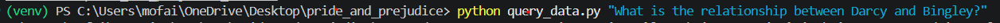
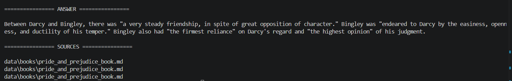

# Pride and Prejudice RAG

A Retrieval-Augmented Generation (RAG) application that answers questions about Jane Austen's *Pride and Prejudice* using semantic search, vector embeddings, and Google's Gemini API.

## Features

* Load and process text documents
* Split documents into semantic chunks
* Generate vector embeddings using Sentence Transformers
* Store embeddings in ChromaDB
* Retrieve relevant passages using similarity search
* Generate answers using Google's Gemini API
* Display retrieved chunks, similarity scores, final answer, and sources
* Experiment with chunk size, retrieval depth, and embedding strategies

## Tech Stack

* Python
* LangChain
* ChromaDB
* Hugging Face Sentence Transformers
* Google Gemini API
* Markdown document processing

## How It Works

### 1. Document Loading

The novel is loaded from a Markdown file.

### 2. Text Chunking

The document is split into overlapping chunks using:

* Chunk Size: 800
* Chunk Overlap: 100

### 3. Embedding Generation

Each chunk is converted into a vector representation using:

```python
sentence-transformers/all-mpnet-base-v2
```

### 4. Vector Storage

Embeddings are stored in ChromaDB for efficient semantic retrieval.

### 5. Retrieval

When a question is asked:

* The question is embedded
* Similar chunks are retrieved from ChromaDB
* Top matching passages are selected

### 6. Generation

The retrieved context is passed to Gemini to generate a final answer grounded in the retrieved evidence.

## Installation

Clone the repository:

```bash
git clone https://github.com/yourusername/pride-and-prejudice-rag.git
cd pride-and-prejudice-rag
```

Create a virtual environment:

```bash
python -m venv venv
```

Activate it:

### Windows

```bash
venv\Scripts\activate
```

### Linux/Mac

```bash
source venv/bin/activate
```

Install dependencies:

```bash
pip install -r requirements.txt
```

## Build the Vector Database

```bash
python create_database.py
```

This will:

* Load the novel
* Create chunks
* Generate embeddings
* Store them in ChromaDB

## Screenshots

### Query



### Retrieved Chunks


### Generated Answer and Souces



## Results

The system performs well on questions whose answers are explicitly present in the retrieved text.

Examples include:

* Character identification
* Direct quotations
* Events and interactions
* Dialogue-based questions

### Limitations

Performance decreases when:

* Information is distributed across multiple chapters
* Questions require combining several passages
* Answers depend on long-range narrative understanding
* Important context is not retrieved among the top-k chunks

These limitations motivated the exploration of more structured retrieval systems for future recommendation-based applications.

## Key Findings

Through experimentation with chunking, retrieval, and generation, several important observations emerged:

* Questions whose answers were contained within a single chunk were answered reliably.
* Increasing retrieval depth (*k*) sometimes reduced answer quality by introducing irrelevant context.
* Smaller chunk sizes improved retrieval precision but often lost important surrounding context.
* Larger chunk sizes preserved context but occasionally reduced retrieval accuracy.
* Even when the correct passage was retrieved, the language model could still ignore the evidence and generate an incorrect answer.
* Retrieval quality was often a greater bottleneck than generation quality.


